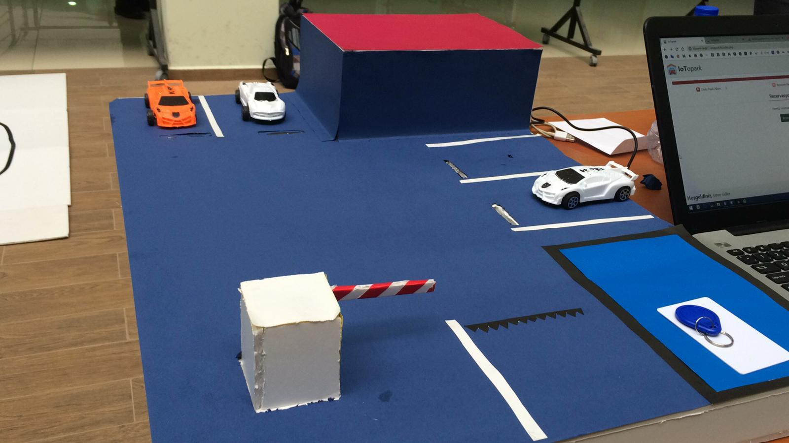
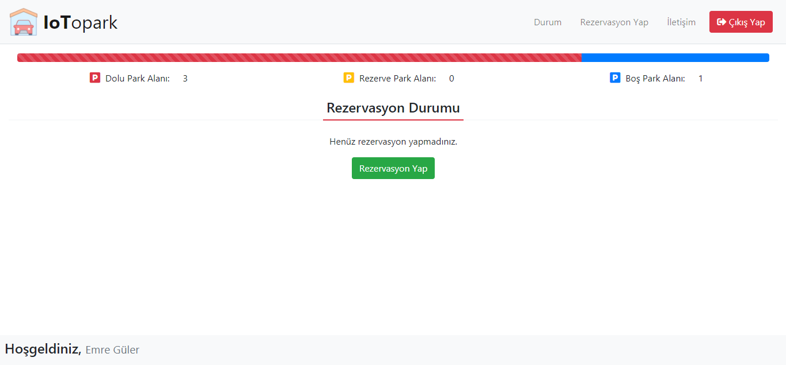

# This project is an IoT-based Smart Parking System designed to connect a parking facility to the internet, enabling real-time monitoring and remote management.

**Author:** Emre Güler **Date:** January 2019

### Abstract

The IoT Smart Parking System is a system that enables the parking lot to connect to the internet using IoT (Internet of Things), allowing it to communicate with other objects. The main purpose of our project is to create a smart parking lot using IoT technology. The primary features of this smart parking system include a reservation system, an entry-exit information system, parking space occupancy detection, fee calculation, and a website where all these operations are managed. The project consists of three main parts. The first part is the software, which is divided into Arduino programming and web programming. The second part is the electronic circuitry, where all electronic circuits were installed and components, primarily the Arduino Mega with its built-in Wi-Fi module (ESP8266), were connected. The third part is the prototype, which integrates the electronic circuits into a miniature parking lot model created to test the project's real-world applicability and success.

### Key Features

*   **Reservation System:** Users can reserve a parking space through the web interface.
    
*   **Entry-Exit System:** Member entry and exit are controlled via RFID cards.
    
*   **Occupancy Detection:** The status of parking spaces is detected in real-time using infrared sensors (TCRT 5000).
    
*   **Automatic Fee Calculation:** Fees are calculated based on entry-exit times and reservation durations.
    
*   **Web Interface:** A dedicated website for managing and monitoring all operations.
    

### Prototype

The prototype was created by integrating the electronic circuits onto a parking lot model made from architectural model board.

| Prototype Overview                               | Web Interface                                    |
| :----------------------------------------------- | :----------------------------------------------- |
|    |  |

**Project Demonstration Video**

[Watch the Project Video](media/project_video.mp4)

### Technologies and Materials

**Software:**

*   **Microcontroller:** Arduino (C/C++)
    
*   **Web Server:** PHP, HTML, CSS, Bootstrap
    
*   **Database:** MySQL
    
*   **Communication Protocol:** HTTP POST
    

**Hardware:**

*   WiFi-enabled Arduino Mega (ESP8266+Atmega2560)
    
*   TCRT 5000 Infrared Sensor
    
*   RC522 RFID Reader (13.56 Mhz)
    
*   Mini Servo Motor (TowerPro SG90)
    
*   LM2596 Voltage Regulator
    

### Operating Principle

1.  **Initialization:** When the system is powered on, the Arduino connects to the database to retrieve the RFID card information of registered members.
    
2.  **Sensor Data:** It periodically reads the infrared sensors in the parking spaces and sends the occupancy status to the web server.
    
3.  **Reservation Control:** Based on the response from the server, it checks for active reservations and closes the barrier (servo motor) of the respective parking space.
    
4.  **Entry Control:** The RFID reader at the entrance continuously scans for cards. If a registered card is detected, it opens the entry barrier, sends the entry record to the server, and turns on a green LED. If the card is not registered, it gives a warning with a red LED.
    
5.  **Web Interface:** Users can view available parking spaces, make reservations, and track their balance through the web interface. An administrator can manage all records and collections.
    

### Getting Started

Follow these instructions to get a copy of the project up and running on your local machine for development and testing purposes.

#### 1\. Configuration

Before running the project, you need to configure a few files with your specific settings. **Never commit sensitive information (like passwords) to a public repository.**

**A. Arduino Code (`src/arduino_code.ino`)**

Open the `arduino_code.ino` file and update the following placeholder values:

    // Update with your WiFi network name (SSID)
    #define ssid "YOUR_WIFI_SSID"
    
    // Update with your WiFi password
    #define pass "YOUR_WIFI_PASSWORD"
    
    // Update with the domain of your web server
    #define server "your-domain.com"
    
    // Change this to a long, random, and secret string
    // This key must match the one in `control.php`
    String apiKey = "YOUR_SECRET_API_KEY";
    
    

**B. Server-Side Code (`src/control.php`)**

Open the `control.php` file and update the following placeholders:

    // 1. This key must match the one in arduino_code.ino
    $deviceKey = "YOUR_SECRET_API_KEY";
    
    // 2. Update the redirect URL to your main domain
    // This is used to redirect unauthorized requests.
    header("Location: http://your-domain.com");
    
    

**C. Database Connection**

The project requires a database connection file to communicate with your MySQL database. This file is **intentionally excluded** from the repository for security reasons.

1.  Create a file named `db_connect.php` in the `src/` directory.
    
2.  Add the following code to the file, replacing the placeholder values with your actual database credentials.
    
        <?php
        // db_connect.php - Database Connection File
        
        $host = 'localhost';    // Your database host (e.g., 'localhost' or an IP address)
        $dbname = 'iot_parking'; // Your database name
        $username = 'root';     // Your database username
        $password = 'your_database_password'; // Your database password
        
        try {
            $conn = new PDO("mysql:host=$host;dbname=$dbname;charset=utf8", $username, $password);
            // Set the PDO error mode to exception
            $conn->setAttribute(PDO::ATTR_ERRMODE, PDO::ERRMODE_EXCEPTION);
        } catch(PDOException $e) {
            // On connection failure, stop the script and show an error.
            // In a production environment, you might want to log this error instead of displaying it.
            die("Database connection failed: " . $e->getMessage());
        }
        ?>
        
        
    
3.  **IMPORTANT:** Create a `.gitignore` file in the root of your project directory and add `db_connect.php` to it to prevent accidentally committing it.
    
        # .gitignore
        
        # Ignore sensitive database connection file
        src/db_connect.php
        
        
    

#### 2\. Database Structure

You need to create the following tables in your MySQL database for the system to work correctly.

    -- Table structure for `kayitlar` (records)
    CREATE TABLE `kayitlar` (
      `id` int(11) NOT NULL AUTO_INCREMENT,
      `uye` varchar(15) NOT NULL,
      `tarih` bigint(20) UNSIGNED NOT NULL,
      `tip` int(10) UNSIGNED NOT NULL DEFAULT 1,
      PRIMARY KEY (`id`)
    ) ENGINE=InnoDB DEFAULT CHARSET=utf8;
    
    -- Table structure for `parkyerleri` (parking_spaces)
    CREATE TABLE `parkyerleri` (
      `id` int(11) NOT NULL AUTO_INCREMENT,
      `durum` int(1) NOT NULL DEFAULT 0,
      `uye` int(11) NOT NULL DEFAULT 0,
      `rezbas` bigint(20) UNSIGNED NOT NULL,
      PRIMARY KEY (`id`)
    ) ENGINE=InnoDB DEFAULT CHARSET=utf8;
    
    -- Table structure for `uyeler` (members)
    CREATE TABLE `uyeler` (
      `id` int(11) NOT NULL AUTO_INCREMENT,
      `kart` varchar(15) COLLATE utf8_unicode_ci NOT NULL,
      `isim` varchar(100) COLLATE utf8_unicode_ci NOT NULL,
      `girsay` int(1) NOT NULL DEFAULT 0,
      PRIMARY KEY (`id`)
    ) ENGINE=InnoDB DEFAULT CHARSET=utf8;
    
    

### Future Enhancements

This project serves as a solid foundation, but there are many ways it could be improved and expanded. Here are a few ideas:

*   **Mobile Application:** Develop a mobile app for users to find parking, make reservations, and manage their accounts.
    
*   **Payment Gateway Integration:** Integrate a payment system (like Stripe or PayPal) for seamless and automated payments.
    
*   **Advanced Analytics:** Create a dashboard for parking lot owners to view analytics, such as peak hours, average parking duration, and revenue reports.
    
*   **License Plate Recognition:** Use a camera with OCR to automatically recognize license plates for entry and exit, removing the need for RFID cards.
    
*   **Multi-Lot Support:** Scale the system to manage multiple parking lots from a single interface.
    

### Contributing

Contributions are what make the open-source community such an amazing place to learn, inspire, and create. Any contributions you make are **greatly appreciated**.

If you have a suggestion that would make this better, please fork the repo and create a pull request. You can also simply open an issue with the tag "enhancement".

1.  Fork the Project
    
2.  Create your Feature Branch (`git checkout -b feature/AmazingFeature`)
    
3.  Commit your Changes (`git commit -m 'Add some AmazingFeature'`)
    
4.  Push to the Branch (`git push origin feature/AmazingFeature`)
    
5.  Open a Pull Request
    

### License

This project is licensed under the MIT License. See the [LICENSE](https://www.google.com/search?q=LICENSE "null") file for details.
